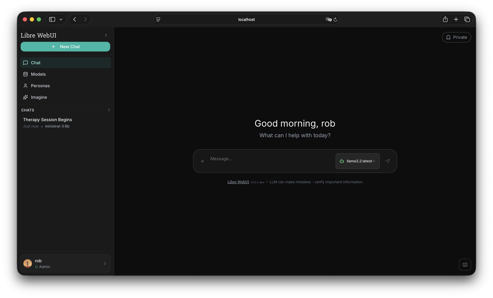

<div align="center">

# Libre WebUI

### Privacy-First AI Chat Interface

<p align="center">
  <strong>Self-hosted • Open Source • Extensible</strong><br>
  <sub>Enterprise support by <a href="https://kroonen.ai">Kroonen AI</a></sub>
</p>

<p>
  
</p>

<p align="center">
  
  
  
  <a href="https://github.com/libre-webui/libre-webui"></a>
</p>

<p align="center">
  
  
  
</p>

[Website](https://librewebui.org) • [Documentation](https://docs.librewebui.org) • [𝕏](https://x.com/librewebui) • [Sponsor](https://github.com/sponsors/libre-webui) • [Get Started](#quick-start)

</div>

---

## Why Libre WebUI?

A simple, self-hosted interface for AI chat. Run it locally with Ollama, connect to OpenAI, Anthropic, or 9+ providers—all from one UI.

- **Your data stays yours** — Zero telemetry, fully self-hosted
- **Extensible plugin system** — Ollama, OpenAI, Anthropic, and any OpenAI-compatible API
- **Simple & focused** — Keyboard shortcuts, dark mode, responsive design

---

## Features

<table>
<tr>
<td width="50%">

### Core Experience

- Real-time streaming chat
- Dark/light themes
- VS Code-style keyboard shortcuts
- Mobile-responsive design
- **Native Desktop App** — macOS (Windows & Linux coming soon)

### AI Providers

- **Local**: Ollama (full integration)
- **Cloud**: OpenAI, Anthropic, Google, Groq, Mistral, OpenRouter, and more
- **Plugin System** — Add any OpenAI-compatible API via JSON config

</td>
<td width="50%">

### Advanced Capabilities

- **Document Chat (RAG)** — Upload PDFs, chat with your docs
- **Custom Personas** — AI personalities with memory
- **Interactive Artifacts** — Live HTML, SVG, code preview
- **Text-to-Speech** — Multiple voices and providers
- **SSO Authentication** — GitHub, Hugging Face OAuth

### Security

- AES-256-GCM encryption
- Role-based access control
- Enterprise compliance ready

</td>
</tr>
</table>

---

## Quick Start

**Requirements:** [Ollama](https://ollama.ai) (for local AI) or API keys for cloud providers

### One Command Install

```bash
npx libre-webui
```

That's it. Opens at `http://localhost:8080`

### Homebrew (macOS)

```bash
# CLI version (includes backend server)
brew tap libre-webui/tap
brew install libre-webui
libre-webui

# Or desktop app
brew install --cask libre-webui
```

Run as a background service:

```bash
brew services start libre-webui
```

### Docker

| Setup                                     | Command                                                      |
| ----------------------------------------- | ------------------------------------------------------------ |
| Bundled Ollama (CPU)                      | `docker-compose up -d`                                       |
| Bundled Ollama (NVIDIA GPU)               | `docker-compose -f docker-compose.gpu.yml up -d`             |
| External Ollama (already running on host) | `docker-compose -f docker-compose.external-ollama.yml up -d` |

Access at `http://localhost:8080`

<details>
<summary><strong>Development builds (unstable)</strong></summary>

> **Warning:** Development builds are automatically generated from the `dev` branch and may contain experimental features, breaking changes, or bugs. Use at your own risk and do not use in production environments.

| Setup                             | Command                                                          |
| --------------------------------- | ---------------------------------------------------------------- |
| Dev + Bundled Ollama (CPU)        | `docker-compose -f docker-compose.dev.yml up -d`                 |
| Dev + Bundled Ollama (NVIDIA GPU) | `docker-compose -f docker-compose.dev.gpu.yml up -d`             |
| Dev + External Ollama             | `docker-compose -f docker-compose.dev.external-ollama.yml up -d` |

Development builds use separate data volumes (`libre_webui_dev_data`) to prevent conflicts with stable installations.

To pull the latest dev image manually:

```bash
docker pull librewebui/libre-webui:dev
```

</details>

### Kubernetes (Helm)

```bash
helm install libre-webui oci://ghcr.io/libre-webui/charts/libre-webui
```

<details>
<summary><strong>Helm configuration options</strong></summary>

```bash
# With external Ollama
helm install libre-webui oci://ghcr.io/libre-webui/charts/libre-webui \
  --set ollama.bundled.enabled=false \
  --set ollama.external.enabled=true \
  --set ollama.external.url=http://my-ollama:11434

# With NVIDIA GPU support
helm install libre-webui oci://ghcr.io/libre-webui/charts/libre-webui \
  --set ollama.bundled.gpu.enabled=true

# With Ingress
helm install libre-webui oci://ghcr.io/libre-webui/charts/libre-webui \
  --set ingress.enabled=true \
  --set ingress.hosts[0].host=chat.example.com
```

See [helm/libre-webui/values.yaml](helm/libre-webui/values.yaml) for all configuration options.

</details>

### Development Setup

```bash
# 1. Clone the repo
git clone https://github.com/libre-webui/libre-webui
cd libre-webui

# 2. Configure environment
cp backend/.env.example backend/.env

# 3. Install and run
npm install && npm run dev
```

### Configuration

Edit `backend/.env` to add your API keys:

```env
# Local AI (Ollama)
OLLAMA_BASE_URL=http://localhost:11434

# Cloud AI Providers (add the ones you need)
OPENAI_API_KEY=sk-...
ANTHROPIC_API_KEY=sk-ant-...
```

### Desktop App (In Development)

> **Note:** The desktop app is currently in active development. The macOS build is pending Apple notarization, which may cause security warnings or installation issues on some systems. We're working to resolve this. Feedback and bug reports are welcome!

Download the native desktop app from [GitHub Releases](https://github.com/libre-webui/libre-webui/releases):

| Platform              | Status                  |
| --------------------- | ----------------------- |
| macOS (Apple Silicon) | Beta (`.dmg` or `.zip`) |
| Windows               | Coming soon             |
| Linux                 | Coming soon             |

---

> [!NOTE]
>
> ## Enterprise Services
>
> **Need a custom deployment?** [Kroonen AI](https://kroonen.ai) provides professional services for Libre WebUI deployments.
>
> | Service                       | Use Case                              |
> | ----------------------------- | ------------------------------------- |
> | On-premise & cloud deployment | HIPAA, SOC 2, air-gapped environments |
> | SSO integration               | Okta, Azure AD, SAML, LDAP            |
> | Custom development            | Integrations, white-labeling, plugins |
> | SLA-backed support            | Priority response, dedicated channel  |
>
> **Contact:** enterprise@kroonen.ai | **[Learn more →](https://kroonen.ai/services)**

> [!TIP]
>
> ## Support Development
>
> Libre WebUI is built and maintained independently. Your support keeps it free and open source.
>
> [](https://github.com/sponsors/libre-webui)
>
> **[Become a Sponsor](https://github.com/sponsors/libre-webui)** — Help fund active development

---

## Community

- [Ethical Charter](./CHARTER.md) — Our commitment to privacy, freedom & transparency
- [Contributing](https://github.com/libre-webui/libre-webui/contribute) — Help improve Libre WebUI
- [𝕏 @librewebui](https://x.com/librewebui) — Follow for updates
- [Mastodon](https://fosstodon.org/@librewebui) — Fediverse updates
- [GitHub Issues](https://github.com/libre-webui/libre-webui/issues) — Bug reports & feature requests
- [Documentation](https://docs.librewebui.org) — Guides & API reference

---

<div align="center">

**Apache 2.0 License** • Copyright © 2025–present Libre WebUI™

Built & maintained by [Kroonen AI](https://kroonen.ai) • [Enterprise Support](https://kroonen.ai/services)

</div>
